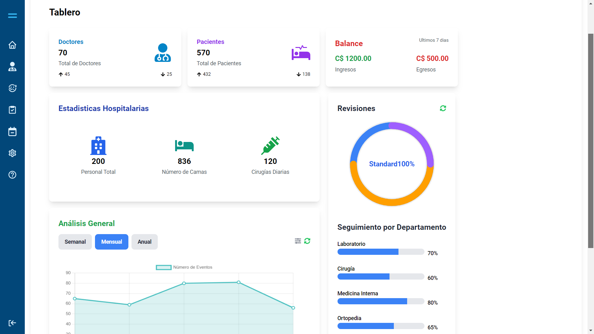

# Clinic App

## Project Description 🏥

Clinic App is a web application designed for patient management in a clinic, providing functionalities to manage medical records, schedule appointments, visualize and manage patient appointments, and access information about clinic doctors. This project is currently under construction and is a fundamental part of my portfolio as a developer.

## Screenshots / Demo 📸

Explore a demo of Clinic App [here](https://medical-web-app.vercel.app).



## Installation 🛠️

As part of the project, the code is organized in a monorepository using TurboRepo from Vercel. To try it out, make sure you have [Yarn](https://yarnpkg.com/) installed. Installing dependencies is straightforward, just run the following command from the project's root:

```bash
yarn
```

## Project Usage 🚀

To build all applications and packages, use the following command:

```bash
yarn run build
```

To develop applications and packages, run the following command:

```bash
yarn run dev
```

You can also access individual applications in the `apps` folder and run the same command.

### Applications and Packages 📦

- `docs`: a [Next.js](https://nextjs.org/) application
- `app`: another [Next.js](https://nextjs.org/) application
- `ui`: a React component library shared by the `web` and `docs` applications
- `eslint-config-custom`: `eslint` configurations (includes `eslint-config-next` and `eslint-config-prettier`)
- `tsconfig`: `tsconfig.json` files used throughout the monorepo
- `tailwind`: a package providing styling utilities using Tailwind CSS

## Technologies Used ⚙️

The development of Clinic App has utilized various technologies, including:

- TurboRepo
- Next.js
- React
- Redux
- Storybook
- Tailwind CSS
- Yarn

### Utilities 🧰

Within this turborepo, some additional tools have already been set up to simplify the experience:

- [TypeScript](https://www.typescriptlang.org/) for static type checking
- [ESLint](https://eslint.org/) for code linting
- [Prettier](https://prettier.io) for code formatting
- [Husky](https://github.com/typicode/husky) to run scripts before Git events

## Project Status 🚧

Clinic App is under development, and there are still areas being improved, both in design and functionality, as well as in documentation.

## Contribution 🤝

So far, the project is primarily intended as part of my portfolio, and specific contribution guidelines have not been established.

## License ⚖️

This project is distributed under the MIT License. Thank you for your interest!
